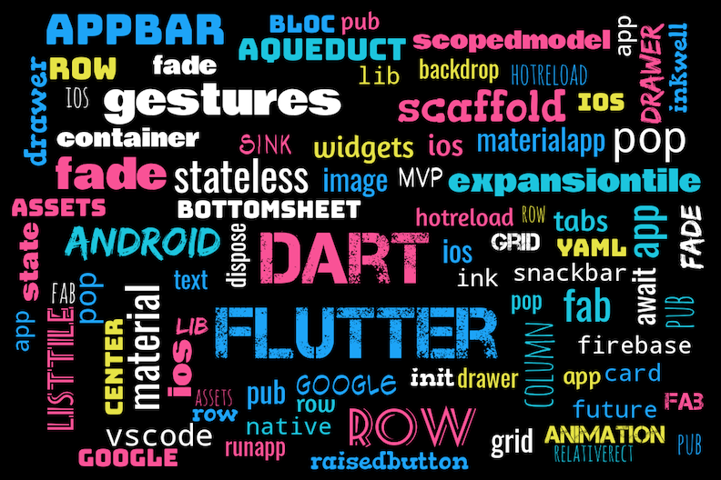

# Flutter QRCode Scanner APP

### Show some :heart: and star the repo to support the project

A new Flutter project.

### Features

* [x] Scan 2D barcodes
* [x] Scan QR codes
* [x] Control the flash while scanning
* [x] Permission handling
* [ ] Support multiple barcode libraries

## Getting Started

### Flutter Project

* Add this to your package's pubspec.yaml file:

  `dependencies: barcode_scan: "^1.0.0"`

### Android

For Android, you must do the following before you can use the plugin:

* Add the camera permission to your AndroidManifest.xml

  `<uses-permission android:name="android.permission.CAMERA" />`

* Add the Barcode activity to your AndroidManifest.xml
  `<activity android:name="com.apptreesoftware.barcodescan.BarcodeScannerActivity"/>`

### iOS

To use on iOS, you must add the the camera usage description to your Info.plist

    <key>NSCameraUsageDescription</key>
    <string>Camera permission is required for barcode scanning.</string>

## Getting Started with Flutter

For help getting started with Flutter, view our online
[documentation](https://flutter.io/).
